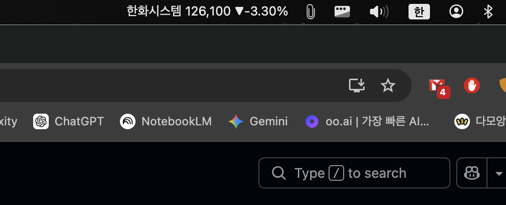
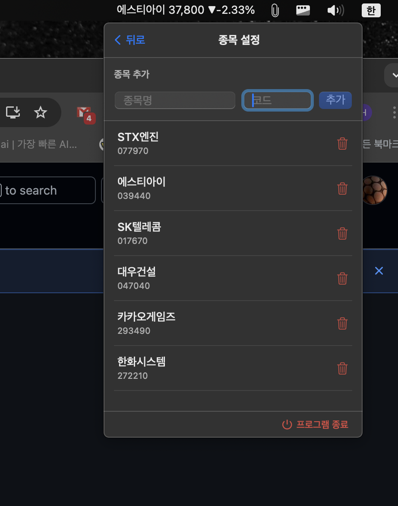

# 📈 슬쩍(SLJJUK) (KPIBar) — macOS 메뉴바 주가 앱

**슬쩍(SLJJUK)**은 macOS 메뉴바에서 실시간으로 주가를 모니터링할 수 있는 SwiftUI 기반의 경량 애플리케이션입니다. 네이버 증권 API를 활용하여 관심 종목의 시세를 롤링 방식으로 표시하며, 업무 중에도 방해받지 않고 시장 상황을 확인할 수 있도록 설계되었습니다.

## 🚀 주요 기능

-   **메뉴바 롤링 디스플레이**: 여러 개의 관심 종목을 10초 간격으로 순차적으로 메뉴바에 표시합니다.
-   **실시간 데이터 업데이트**: 30초마다 자동으로 최신 주가 정보를 가져옵니다.(NXT 프리장(8:00~09:00), 애프터장(15:40~20:00) 주가는 반영하지 않습니다.)
-   **한국 증시 색상 규칙**: 상승 시 **빨간색**, 하락 시 **파란색**으로 직관적인 시각화를 제공합니다.
-   **간편한 종목 관리**:
    *   6자리 종목코드로 즉시 추가 (예: 삼성전자 005930).
    *   사용자 정의 별명(Alias) 설정 기능 (비워둘 시 실제 종목명 자동 사용).
    *   휴지통 아이콘을 통한 직관적인 종목 삭제 기능.
-   **배경 실행 모드**: Dock 아이콘 없이 메뉴바에서만 동작하는 Agent 모드(`LSUIElement`) 지원.
-   **데이터 영속성**: `UserDefaults`를 통해 앱 재시작 후에도 관심 종목 리스트가 유지됩니다.

## 🛠 기술 스택

-   **Language**: Swift 5.10+
-   **Framework**: SwiftUI (MenuBarExtra API)
-   **Architecture**: MVVM (Model-View-ViewModel)
-   **Data Source**: Naver Stock Unofficial JSON API
-   **OS Support**: macOS 13.0 (Ventura) 이상
-   **IDE**: Xcode 16.2

## 📂 프로젝트 구조

```text
SLJJUK/
├── StockBarApp.swift        # 앱의 진입점 및 메뉴바 인터페이스 정의
├── Models/
│   └── Stock.swift          # 주가 데이터 모델 및 API 응답 파싱 구조체
├── Services/
│   └── NaverStockService.swift # 네이버 증권 API 통신 로직
├── ViewModels/
│   └── StockViewModel.swift  # 비즈니스 로직, 데이터 갱신 및 타이머 관리
└── Views/
    ├── PopoverView.swift    # 메뉴바 클릭 시 나타나는 메인 팝업 (화면 전환 제어)
    ├── SettingsView.swift   # 종목 직접 추가/삭제 및 종료 버튼 설정 화면
    └── StockRowView.swift   # 리스트 내 개별 주가 정보 표시 레이아웃
```

## 🔧 주요 기술적 해결 (Troubleshooting)

### 1. 입력창 클릭 시 메뉴 닫힘 현상 해결
macOS 메뉴바 앱에서 `TextField` 클릭 시 포커스 이동으로 인해 창이 닫히는 고질적인 문제를 해결하기 위해, 기존의 `.sheet` 띄우기 방식 대신 **팝업 내 직접 뷰 전환(Direct View Switching)** 방식을 채택했습니다. 팝업 크기를 고정하고 상태를 전역으로 관리하여 입력 안정성을 확보했습니다.

### 2. 단일 진입점(@main) 정립
템플릿 생성 시 발생한 중복 `@main` 선언(`SLJJUKApp.swift` vs `StockBarApp.swift`)을 정리하고, 메뉴바 전용 앱에 적합한 진입점으로 단일화하여 빌드 에러를 해결했습니다.

### 3. 실시간 리스트 동기화
종목 추가/삭제 시 UI가 즉각 반응하도록 `watchlist`와 `stocks` 배열 간의 동기화 로직을 `Combine`과 `Task` 기반으로 설계하여 사용자 경험을 개선했습니다.


## 📝 사용 팁
-   **종목 코드**: 증권의 종목코드 6자리를 입력하세요.
-   **별명 설정**: 표시명을 입력하지 않으면 자동으로 종목 이름(예: "삼성전자")이 사용됩니다.
-   **완전 종료**: 설정 화면 하단의 **'프로그램 종료'** 버튼을 클릭하면 앱이 완전히 종료됩니다.


